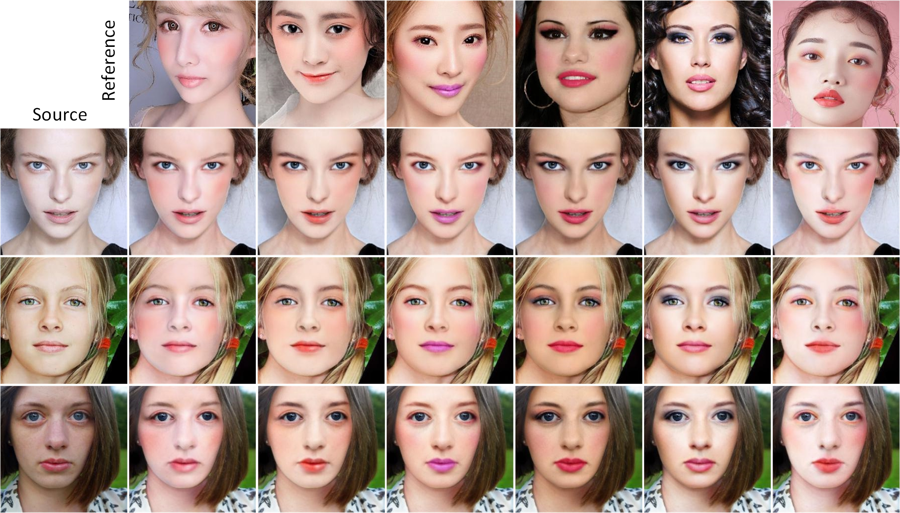
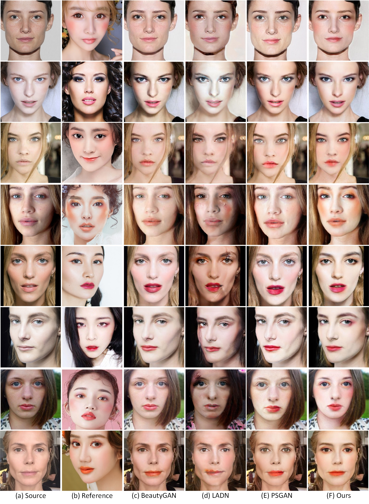

### How to run

+ Download the trained model at https://pan.baidu.com/s/1bFX-WeTHQyDKvh8fOLlUGw   password：aili 
+ Put the image data to be tested in the ’test‘ folder
+ Run test.py
+ The makeup transfer result is in the 'result' folder

### Our result

### Qualitative comparison

